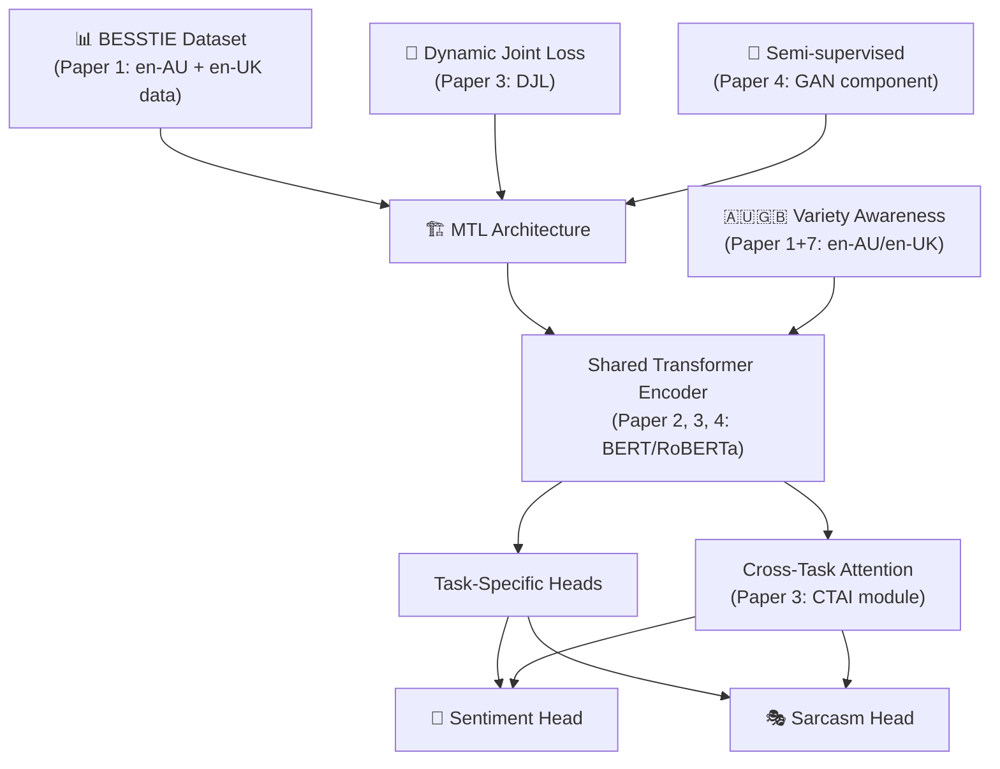

# Phân Tích 9 Papers Cho Bài Toán Phân Biệt Sentiment & Sarcasm Trong Tiếng Anh Anh và Tiếng Anh Úc Bằng Multi-Task Learning

## Bài Toán Của Bạn
**Mục tiêu:** Phân biệt sentiment và sarcasm trong **tiếng Anh Anh (en-UK)** và **tiếng Anh Úc (en-AU)** bằng cách sử dụng model với **multi-task learning (MTL)**.

Đây là bài toán kết hợp 3 trục chính:
1. **Multi-task Learning** — sentiment + sarcasm trong cùng 1 model
2. **Language Variety** — phân biệt en-UK vs en-AU
3. **Text Classification** — phát hiện sarcasm & sentiment

---

## Tổng Quan Các Papers

| # | Paper | Bài Toán Chính | Giải Pháp Chính | Mức Hữu Dụng |
|---|-------|---------------|-----------------|---------------|
| 1 | **BESSTIE** (2412.04726v3) | Benchmark sentiment & sarcasm cho en-AU, en-IN, en-UK | Dataset + fine-tune 9 LLMs | ⭐⭐⭐⭐⭐ **CỰC KỲ HỮU DỤNG** |
| 2 | **Sentiment & Sarcasm MTL** (IEEE IS, Majumder et al.) | Multi-task sentiment + sarcasm | GRU + NTN fusion + shared attention | ⭐⭐⭐⭐⭐ **CỰC KỲ HỮU DỤNG** |
| 3 | **AMTF-Net** (IJCISIM 2026) | Joint sentiment + sarcasm detection | BERT + GPT-2 + XLNet fusion + cross-task attention + dynamic joint loss | ⭐⭐⭐⭐ **RẤT HỮU DỤNG** |
| 4 | **GAN-BERT MTL** (QPAIN 2025) | Sarcasm detection với MTL | GAN-BERT + sentiment/emotion auxiliary tasks | ⭐⭐⭐⭐ **RẤT HỮU DỤNG** |
| 5 | **Disambiguating Sentiment** (D19-5544) | Sentiment classification dùng sarcasm/humor/hate features | CNN embeddings ensemble → sentiment | ⭐⭐⭐ **HỮU DỤNG** |
| 6 | **Sentiment & Emotion help Sarcasm** (ACL 2020) | Multi-modal MTL: sarcasm + sentiment + emotion | BiGRU + Ie/Ia-Attention + multi-modal | ⭐⭐⭐ **HỮU DỤNG** |
| 7 | **Far Out** (VarDial 2026) | LLM hiểu slang en-AU / en-IN | Eval 7 LLMs trên slang prediction/selection | ⭐⭐⭐ **HỮU DỤNG** |
| 8 | **Sarcasm Detection with Context Separators** (FigLang 2020) | Sarcasm detection trên Twitter/Reddit | RoBERTa-large + context separation tokens | ⭐⭐ **THAM KHẢO** |
| 9 | **EICR** (COLING 2025) | Sarcasm detection bằng commonsense reasoning | RAG + LLM + graph reasoning + adversarial contrastive | ⭐⭐ **THAM KHẢO** |

---

## Chi Tiết Từng Paper

---

### 1. ⭐⭐⭐⭐⭐ BESSTIE — BEnchmark for Sentiment and Sarcasm for varieTIes of English
**File:** [2412.04726v3.pdf](file:///d:/VS%20CODE/ALTA/paper/2412.04726v3.pdf)

> [!IMPORTANT]
> **Đây là paper TRỰC TIẾP nhất với bài toán của bạn.** Nó cung cấp cả dataset, methodology, và baseline results cho sentiment + sarcasm classification trên en-AU, en-IN, en-UK.

**Bài toán:** Tạo benchmark cho sentiment & sarcasm classification trên 3 varieties of English (en-AU, en-IN, en-UK).

**Giải pháp:**
- **Dataset:** Thu thập text từ Google Places reviews (location-based) và Reddit comments (topic-based) cho 3 varieties
- **Quality assessment:** Manual annotation + automated validation (fastText + DistilBERT fine-tuned trên ICE-Corpora)
- **Models tested:** 9 LLMs (BERT, RoBERTa, ALBERT, MBERT, MDISTIL, XLM-R, GEMMA, MISTRAL, QWEN)
- **Tasks:** Binary sentiment classification + binary sarcasm classification

**Kết quả quan trọng:**
- **en-AU sentiment:** F1 = 0.78 (avg), sarcasm F1 = 0.62
- **en-UK sentiment:** F1 = 0.74 (avg), sarcasm F1 = 0.58
- **en-IN:** luôn thấp nhất (sentiment 0.63, sarcasm 0.56)
- Encoder models > decoder models cho classification tasks
- **Cross-variety evaluation:** Model trained on en-AU generalise tốt hơn

**Phần có thể dùng cho bài toán của bạn:**
- ✅ **Dataset BESSTIE** (công khai trên HuggingFace) — dataset chính cho experiments
- ✅ **Methodology thu thập & validate data** cho varieties of English
- ✅ **Baseline results** cho en-AU và en-UK
- ✅ **Cross-variety evaluation protocol** — dùng để evaluate cross-variety generalization
- ⚠️ **Thiếu:** Chưa dùng multi-task learning → đây chính là gap mà bạn có thể fill

---

### 2. ⭐⭐⭐⭐⭐ Sentiment and Sarcasm Classification with Multitask Learning
**File:** [Sentiment and Sarcasm Classification with Multitask Learning.pdf](file:///d:/VS%20CODE/ALTA/paper/Sentiment%20and%20Sarcasm%20Classification%20with%20Multitask%20Learning.pdf)

> [!IMPORTANT]
> **Đây là paper cung cấp kiến trúc MTL cốt lõi** cho việc joint sentiment + sarcasm classification. Nó chứng minh rằng 2 tasks này giúp nhau khi train cùng nhau.

**Bài toán:** Joint sentiment classification + sarcasm detection bằng multi-task learning.

**Giải pháp:**
- **Shared GRU** encoder cho cả 2 tasks
- **Task-specific FC layers** (Hsar, Hsen) để tạo representations riêng cho mỗi task
- **Attention mechanism** shared giữa 2 tasks
- **Neural Tensor Network (NTN)** để fuse sarcasm & sentiment representations
- Sarcasm dùng `ssar ⊕ s+` (có fusion), sentiment chỉ dùng `ssen` (không cần fusion)
- **Joint training** tối ưu `Jsen + Jsar` cùng lúc

**Kết quả:**
- MTL with fusion + shared attention → **F1 sentiment = 83.03%, F1 sarcasm = 90.29%** (average F1 = 86.66%)
- Vượt SOTA 3-4% so với standalone classifiers
- Sentiment improvement > Sarcasm improvement (vì sarcasm detection là subtask của sentiment)

**Phần có thể dùng cho bài toán của bạn:**
- ✅ **Kiến trúc MTL** — shared encoder + task-specific heads + NTN fusion
- ✅ **Lý thuyết** về mối quan hệ sentiment ↔ sarcasm trong MTL
- ✅ **Training strategy** — joint loss optimization
- ✅ **Kết luận quan trọng:** Fusion chỉ giúp sarcasm, không cần cho sentiment
- ⚠️ **Thiếu:** Dùng GRU (cũ), chưa dùng Transformer; không xét language varieties

---

### 3. ⭐⭐⭐⭐ AMTF-Net: Adaptive Multi-Task Transformer Fusion Network
**File:** [Sentiment and Emotion help Sarcasm\_ A Multi-task Learning Framework...pdf](file:///d:/VS%20CODE/ALTA/paper/Sentiment%20and%20Emotion%20help%20Sarcasm_%20A%20Multi-task%20Learning%20Framework%20for%20Multi-Modal%20Sarcasm,%20Sentiment%20and%20Emotion%20Analysis.pdf)

**Bài toán:** Joint sentiment analysis + sarcasm detection với multi-task learning.

**Giải pháp:**
- **Multi-transformer fusion:** BERT + GPT-2 + XLNet → Multi-head Attention-based Transformer Fusion (MATF)
- **Shared Semantic Encoder (SSE):** Encode shared representations
- **Cross-Task Attention Interaction (CTAI):** Cho phép 2 tasks trao đổi thông tin
- **Dynamic Joint Loss (DJL):** Tự động cân bằng loss giữa 2 tasks
- Evaluated trên Twitter, Reddit, HuffPost datasets

**Kết quả:**
- Accuracy: 97.74% (Twitter), 98.12% (Reddit), 98.05% (HuffPost)
- F1: 98.12% (Twitter), 98.04% (Reddit), 97.82% (HuffPost) cho sarcasm

**Phần có thể dùng cho bài toán của bạn:**
- ✅ **Cross-Task Attention Interaction module** — cơ chế để 2 tasks sentiment/sarcasm trao đổi thông tin
- ✅ **Dynamic Joint Loss** — cách cân bằng loss giữa sentiment vs sarcasm
- ✅ **Adaptive fusion** của multiple transformers — có thể adapt cho việc xử lý en-AU/en-UK
- ⚠️ Kiến trúc phức tạp, cần đơn giản hóa cho bài toán variety-specific

---

### 4. ⭐⭐⭐⭐ GAN-BERT with Multi-Task Learning
**File:** [Enhancing\_Sarcasm\_Detection\_Using\_GAN-BERT\_with\_Multi-Task\_Learning.pdf](file:///d:/VS%20CODE/ALTA/paper/Enhancing_Sarcasm_Detection_Using_GAN-BERT_with_Multi-Task_Learning.pdf)

**Bài toán:** Sarcasm detection kết hợp semi-supervised learning + MTL.

**Giải pháp:**
- **Shared BERT encoder** → 3 task heads: sarcasm (primary), sentiment (auxiliary), emotion (auxiliary)
- **GAN component:** Discriminator phân biệt labeled vs unlabeled data → semi-supervised learning
- **Total loss:** `L_total = L_sarcasm + λ1·L_sentiment + λ2·L_emotion + L_adv`
- Chỉ sarcasm head hoạt động khi inference

**Kết quả:**
- GAN-BERT MTL: Accuracy **93.88%**, F1 **94.15%** (vượt BERT 92.04%, LSTM 87.16%, CNN 85.18%)

**Phần có thể dùng cho bài toán của bạn:**
- ✅ **MTL architecture** với shared BERT encoder + task-specific heads
- ✅ **Loss function design** với auxiliary task weighting (λ1, λ2)
- ✅ **Semi-supervised learning** (GAN) — hữu dụng nếu data labeled cho en-AU/en-UK ít
- ✅ **Data augmentation** cho MTL bằng pre-trained models (auto-label sentiment/emotion)
- ⚠️ Không xét language varieties

---

### 5. ⭐⭐⭐ Disambiguating Sentiment (D19-5544)
**File:** [D19-5544.pdf](file:///d:/VS%20CODE/ALTA/paper/D19-5544.pdf)

**Bài toán:** Cải thiện sentiment classification bằng features từ sarcasm, humor, hate speech.

**Giải pháp:**
- **Two-step pipeline:** (1) Train riêng embedding models E1-E4 cho sentiment/sarcasm/humor/hate → (2) Concatenate embeddings → sentiment classifier
- CNN-based feature extractor cho mỗi task
- Ensemble 4 task embeddings → FC classifier

**Kết quả:**
- Se alone: 95.95% → Se+Sc+Hu+Ha: **96.18%** accuracy trên Yelp reviews

**Phần có thể dùng cho bài toán của bạn:**
- ✅ **Ý tưởng** ensemble features từ multiple NLU tasks giúp sentiment
- ✅ **Visualization (tSNE)** cho thấy task embeddings chiếm vùng khác nhau trong feature space
- ⚠️ Pipeline approach (không phải end-to-end MTL) → kém hiệu quả hơn joint training
- ⚠️ Không dùng Transformer, không xét varieties

---

### 6. ⭐⭐⭐ Sentiment & Emotion help Sarcasm (ACL 2020)
**File:** [2020.acl-main.401.pdf](file:///d:/VS%20CODE/ALTA/paper/2020.acl-main.401.pdf)

**Bài toán:** Multi-modal MTL: sarcasm (primary) + sentiment + emotion (secondary tasks).

**Giải pháp:**
- **Multi-modal:** Text + Visual + Acoustic
- **Two attention mechanisms:** Ie-Attention (inter-segment inter-modal) & Ia-Attention (intra-segment inter-modal)
- 5 task heads: sarcasm, implicit/explicit sentiment, implicit/explicit emotion
- Shared representation → gradient updates từ tất cả 5 branches

**Kết quả:**
- MTL (Sar+Sent+Emo) F1 = 72.57% (speaker dependent), 65.90% (speaker independent)
- Speaker information cải thiện 1-5%

**Phần có thể dùng cho bài toán của bạn:**
- ✅ **Ý tưởng** sentiment & emotion auxiliary tasks giúp sarcasm
- ✅ **Implicit vs Explicit** sentiment/emotion — concept hữu ích cho sarcasm trong different varieties
- ✅ **Speaker-dependent vs independent setup** — tương tự variety-dependent/independent
- ⚠️ Chủ yếu multi-modal (text + video + audio) → bạn chỉ cần text
- ⚠️ Dataset nhỏ (690 samples từ TV shows)

---

### 7. ⭐⭐⭐ Far Out: Slang in Australian and Indian English (VarDial 2026)
**File:** [2026.vardial-1.2.pdf](file:///d:/VS%20CODE/ALTA/paper/2026.vardial-1.2.pdf)

**Bài toán:** Đánh giá khả năng LLMs hiểu slang trong en-AU và en-IN.

**Giải pháp:**
- **WEB dataset** (377 slang phrases từ Urban Dictionary) + **GEN dataset** (1,492 LLM-generated examples)
- 3 tasks: Target Word Prediction (TWP), Guided TWP*, Target Word Selection (TWS)
- Test 7 models (BERT, RoBERTa, XLM-R, Granite, Llama, Olmo, Qwen)

**Kết quả quan trọng:**
- en-IN outperforms en-AU (TWS: 0.54 vs 0.44) — models hiểu slang en-IN tốt hơn en-AU
- Models generate slang rất kém (TWP accuracy max 0.13) nhưng nhận diện tốt hơn (TWS up to 0.8)

**Phần có thể dùng cho bài toán của bạn:**
- ✅ **Evidence** rằng LLMs yếu với en-AU → motivation cho variety-specific training
- ✅ **Error analysis framework** (literalisation, generic substitution, semantic drift, contextual misinterpretation, true failure)
- ✅ **Dataset creation methodology** cho en-AU/en-IN slang
- ⚠️ Không trực tiếp về sentiment/sarcasm; tập trung vào slang understanding

---

### 8. ⭐⭐ Sarcasm Detection using Context Separators (FigLang 2020)
**File:** [2020.figlang-1.6.pdf](file:///d:/VS%20CODE/ALTA/paper/2020.figlang-1.6.pdf)

**Bài toán:** Sarcasm detection trên Twitter và Reddit dùng context.

**Giải pháp:**
- **RoBERTa-large** fine-tuned với 3 input types: Response-only, Context-Response, Context-Response (Separated)
- Separation token giữa context và response

**Kết quả:** 
- Context-Response (Separated) cải thiện F1 +5.13% trên Reddit

**Phần có thể dùng cho bài toán của bạn:**
- ✅ **Context separation technique** — có thể dùng separation token giữa variety-specific context
- ⚠️ Không MTL, không variety-specific

---

### 9. ⭐⭐ EICR: Emotional Incongruity via Commonsense Reasoning (COLING 2025)
**File:** [2025.coling-main.608.pdf](file:///d:/VS%20CODE/ALTA/paper/2025.coling-main.608.pdf)

**Bài toán:** Sarcasm detection bằng commonsense reasoning.

**Giải pháp:**
- **RAG-based commonsense augmentation** (Bing search + GPT-4o)
- **Graph-based incongruity reasoning** (dependency graph + enrichment/pruning)
- **Adversarial contrastive learning** chống spurious bias

**Phần có thể dùng cho bài toán của bạn:**
- ✅ **Adversarial contrastive learning** — chống bias (có thể áp dụng cho variety bias)
- ⚠️ Phức tạp, chủ yếu cho commonsense reasoning, không MTL, không variety-specific

---

## Đề Xuất Kết Hợp Cho Bài Toán Của Bạn

> [!TIP]
> ### Roadmap đề xuất

### Phần cụ thể nên lấy từ mỗi paper:

| Thành phần | Lấy từ Paper | Chi tiết |
|-----------|-------------|---------|
| **Dataset** | Paper 1 (BESSTIE) | en-AU + en-UK subsets (Google + Reddit) |
| **MTL Framework** | Paper 2 (Majumder et al.) | Shared encoder + task-specific heads + NTN fusion |
| **Cross-Task Interaction** | Paper 3 (AMTF-Net) | Cross-Task Attention Interaction (CTAI) module |
| **Loss Function** | Paper 3 + 4 | Dynamic Joint Loss hoặc weighted sum `L_sent + λ·L_sarc` |
| **Semi-supervised** | Paper 4 (GAN-BERT) | GAN discriminator nếu data ít |
| **Variety Evaluation** | Paper 1 + 7 | Cross-variety eval protocol, error analysis taxonomy |
| **Context Handling** | Paper 8 (FigLang) | Separation tokens cho context |
| **Motivation/Related Work** | Paper 5, 6 | Evidence rằng sentiment ↔ sarcasm giúp nhau |

### Papers KHÔNG nên dùng trực tiếp:
- **Paper 6 (ACL 2020):** Multi-modal (cần video/audio) → bạn chỉ cần text
- **Paper 9 (EICR):** Quá phức tạp, tập trung commonsense reasoning → không cần thiết cho bài toán variety

---

## Kết Luận

| Nhóm | Papers | Vai trò |
|------|--------|---------|
| **Cốt lõi (PHẢI đọc kỹ)** | 1 (BESSTIE), 2 (Sentiment & Sarcasm MTL) | Dataset + MTL architecture nền tảng |
| **Bổ sung kiến trúc** | 3 (AMTF-Net), 4 (GAN-BERT MTL) | Cải tiến MTL: cross-task attention, dynamic loss, semi-supervised |
| **Hỗ trợ motivation** | 5 (D19-5544), 6 (ACL 2020), 7 (Far Out) | Evidence cho sentiment↔sarcasm relationship, variety gaps |
| **Tham khảo nhẹ** | 8 (FigLang), 9 (EICR) | Kỹ thuật context handling, contrastive learning |

> [!CAUTION]
> **Gap chính mà bạn cần fill:** Không có paper nào kết hợp cả 3 yếu tố: **MTL (sentiment+sarcasm)** + **language variety awareness (en-AU vs en-UK)** + **Transformer-based architecture**. Đây chính là novelty contribution tiềm năng cho nghiên cứu của bạn.
